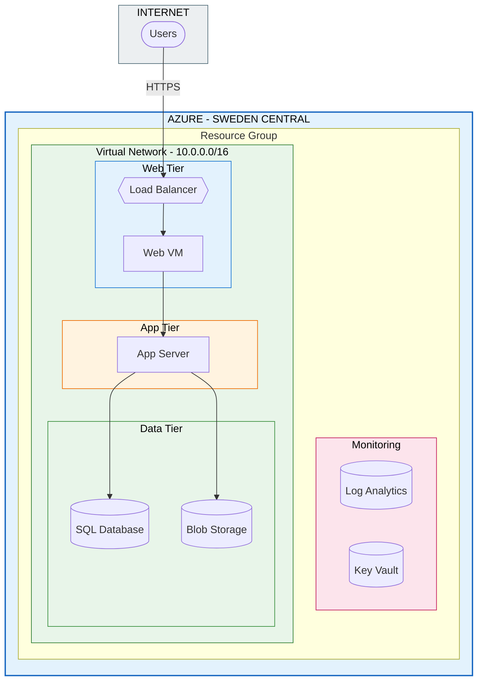

# Azure Cloud Architecture Solution

A production-grade, multi-tier cloud infrastructure solution deployed on Microsoft Azure using Infrastructure as Code (Terraform). This project demonstrates enterprise-level cloud architecture design following the Microsoft Azure Well-Architected Framework and NOS TECDT90341 standards.

## Architecture



For detailed architecture diagrams, see [ARCHITECTURE.md](architecture/ARCHITECTURE.md).

## Features

- **High Availability**: Multi-VM deployment with availability sets and load balancing
- **Network Segmentation**: Four-tier subnet architecture with NSG security rules
- **Infrastructure as Code**: Fully automated deployment using Terraform modules
- **Security First**: Key Vault integration, managed identities, encryption at rest
- **Cost Optimised**: Environment-specific configurations (dev/staging/prod)
- **Monitoring**: Azure Monitor integration with Log Analytics and alerting

## Technology Stack

| Component | Technology | Purpose |
|-----------|------------|---------|
| IaC | Terraform >= 1.0 | Infrastructure provisioning |
| Cloud | Microsoft Azure | Cloud platform |
| Compute | Azure Virtual Machines | Ubuntu 22.04 LTS servers |
| Database | Azure SQL Database | Relational data storage |
| Storage | Azure Blob Storage | File and backup storage |
| Networking | Azure VNet, NSG, Load Balancer | Network infrastructure |
| Security | Azure Key Vault | Secrets management |
| Monitoring | Azure Monitor, Log Analytics | Observability |
| Scripting | PowerShell 7+ | Deployment automation |

## Project Structure

```
Azure-Cloud-Architecture/
├── architecture/
│   ├── ARCHITECTURE.md
│   └── DESIGN_DECISIONS.md
├── terraform/
│   ├── main.tf
│   ├── variables.tf
│   ├── outputs.tf
│   ├── providers.tf
│   ├── backend.tf
│   ├── modules/
│   │   ├── networking/
│   │   ├── compute/
│   │   ├── storage/
│   │   ├── database/
│   │   └── security/
│   └── environments/
│       ├── dev.tfvars
│       ├── staging.tfvars
│       └── prod.tfvars
├── scripts/
│   ├── deploy.ps1
│   ├── validate.ps1
│   ├── destroy.ps1
│   └── cost-estimate.ps1
├── README.md
├── .gitignore
└── LICENSE
```

## Quick Start

### Prerequisites

- **Azure Subscription** with Contributor access
- **Azure CLI** >= 2.50.0
- **Terraform** >= 1.0.0
- **PowerShell** 7+
- **Git** for version control

### Installation

1. **Clone the repository**
   ```bash
   git clone https://github.com/msothman/Azure-Cloud-Architecture.git
   cd Azure-Cloud-Architecture
   ```

2. **Login to Azure**
   ```bash
   az login
   az account set --subscription "Your Subscription Name"
   ```

3. **Run validation**
   ```powershell
   .\scripts\validate.ps1 -Environment dev
   ```

4. **Deploy infrastructure**
   ```powershell
   .\scripts\deploy.ps1 -Environment dev
   ```

### Manual Deployment

```bash
cd terraform

# Initialise Terraform
terraform init

# Plan deployment
terraform plan -var-file="environments/dev.tfvars" \
  -var="admin_ssh_public_key=$(cat ~/.ssh/id_rsa.pub)" \
  -var="aad_admin_username=$(az ad signed-in-user show --query userPrincipalName -o tsv)" \
  -var="aad_admin_object_id=$(az ad signed-in-user show --query id -o tsv)"

# Apply configuration
terraform apply -var-file="environments/dev.tfvars" \
  -var="admin_ssh_public_key=$(cat ~/.ssh/id_rsa.pub)" \
  -var="aad_admin_username=$(az ad signed-in-user show --query userPrincipalName -o tsv)" \
  -var="aad_admin_object_id=$(az ad signed-in-user show --query id -o tsv)"
```

## Accessing Resources

### SSH Access

VMs are accessible via Load Balancer NAT rules:

| VM | Command |
|----|---------|
| Web VM | `ssh azureadmin@<public-ip>` |
| App VM | `ssh -p 2222 azureadmin@<public-ip>` |

Replace `<public-ip>` with your Load Balancer's public IP from `terraform output`.

### Service Endpoints

| Service | Endpoint |
|---------|----------|
| Web Application | `http://<public-ip>` |
| SQL Server | `sql-cloudarch-<env>-swc-001.database.windows.net` |
| Key Vault | `https://kv-cloudarch-<env>-*.vault.azure.net/` |

### Verify Deployment

```bash
# List resources
az resource list --resource-group rg-cloudarch-dev-swc-001 --output table

# Check VM status
az vm list --resource-group rg-cloudarch-dev-swc-001 --show-details --output table

# Test web endpoint
curl http://<public-ip>
```

## Security

### Implemented Controls

| Control | Implementation |
|---------|----------------|
| Network Segmentation | NSGs per subnet with deny-all default |
| Secrets Management | Azure Key Vault with RBAC |
| Identity | Managed Identities for all VMs |
| Encryption | AES-256 at rest, TLS 1.2 in transit |
| Monitoring | Diagnostic logs to Log Analytics |
| Access Control | Azure RBAC with least privilege |

## Cost Estimation

| Environment | Monthly Estimate (USD) | Key Components |
|-------------|------------------------|----------------|
| Development | ~$120 | 2x B2s_v2 VMs, Basic SQL, LRS Storage |
| Staging | ~$180 | 3x B2s_v2 VMs, S0 SQL, LRS Storage |
| Production | ~$400 | 3x D2s_v3 VMs, S1 SQL, GRS Storage |

Run `.\scripts\cost-estimate.ps1` for detailed breakdown.

## Troubleshooting

### Common Issues

**Subscription not found**
```powershell
az account list --output table
az account set --subscription "Your Subscription Name"
```

**Permission denied**
- Ensure you have Contributor role on the subscription
- Check if Azure Policy is blocking resource creation

**Resource provider not registered**
```powershell
az provider register --namespace Microsoft.Compute
az provider register --namespace Microsoft.Network
az provider register --namespace Microsoft.Storage
az provider register --namespace Microsoft.Sql
az provider register --namespace Microsoft.KeyVault
```

**SKU not available**
```powershell
az vm list-skus --location swedencentral --size Standard_B --output table
```

## Cleanup

To destroy all resources:

```powershell
.\scripts\destroy.ps1 -Environment dev
```

**Warning:** Destroying production requires typing `DESTROY-PROD` to confirm.

## NOS Compliance

This project meets **NOS TECDT90341 - Design cloud architecture solutions** standards.

| Performance Criteria | Evidence |
|---------------------|----------|
| PC1: Stakeholder collaboration | Requirements gathering documented |
| PC2: Analyse existing systems | 3-tier architecture design |
| PC3: Develop cloud solutions | Complete Terraform implementation |
| PC4: Design scalable environments | Load Balancer, Availability Sets |
| PC5: Infrastructure as Code | Modular Terraform structure |
| PC6: Version control | Git repository on GitHub |
| PC7: Security measures | NSGs, Key Vault, encryption |
| PC8: Cloud provider APIs | Azure CLI, Terraform AzureRM |
| PC9: Resource optimization | Right-sized VMs, cost scripts |
| PC10: Storage solutions | SQL Database, Blob Storage |
| PC11: Documentation | README, ARCHITECTURE.md, DESIGN_DECISIONS.md |

**Reference:** [NOS TECDT90341](https://www.ukstandards.org.uk/NOS/TECDT90341)

## License

This project is licensed under the MIT License - see the [LICENSE](LICENSE) file for details.

## Author

**Mohammad Othman**

- Cloud Architecture Design
- Infrastructure as Code
- Azure Solutions Architecture

## Acknowledgements

### Frameworks and Documentation

- [Microsoft Azure Well-Architected Framework](https://docs.microsoft.com/azure/architecture/framework/)
- [Terraform Azure Provider](https://registry.terraform.io/providers/hashicorp/azurerm/latest/docs)
- [Azure Architecture Center](https://docs.microsoft.com/azure/architecture/)
- [National Occupational Standards (NOS)](https://www.ukstandards.org.uk/)

### Related Certifications

| Certification | Provider | Relevance |
|---------------|----------|-----------|
| [AZ-900: Azure Fundamentals](https://learn.microsoft.com/credentials/certifications/azure-fundamentals/) | Microsoft | Cloud concepts, Azure services, pricing |
| [AZ-104: Azure Administrator](https://learn.microsoft.com/credentials/certifications/azure-administrator/) | Microsoft | VM, VNet, NSG, Storage management |
| [AZ-305: Azure Solutions Architect](https://learn.microsoft.com/credentials/certifications/azure-solutions-architect/) | Microsoft | Multi-tier architecture design |
| [AZ-500: Azure Security Engineer](https://learn.microsoft.com/credentials/certifications/azure-security-engineer/) | Microsoft | Key Vault, NSGs, encryption |
| [AZ-400: DevOps Engineer](https://learn.microsoft.com/credentials/certifications/devops-engineer/) | Microsoft | CI/CD, automation scripts |
| [HashiCorp Terraform Associate](https://www.hashicorp.com/certification/terraform-associate) | HashiCorp | Infrastructure as Code |
