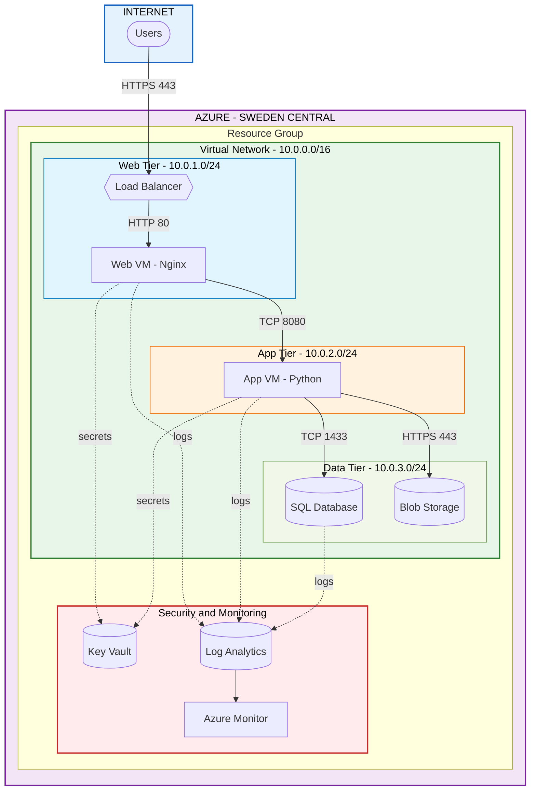
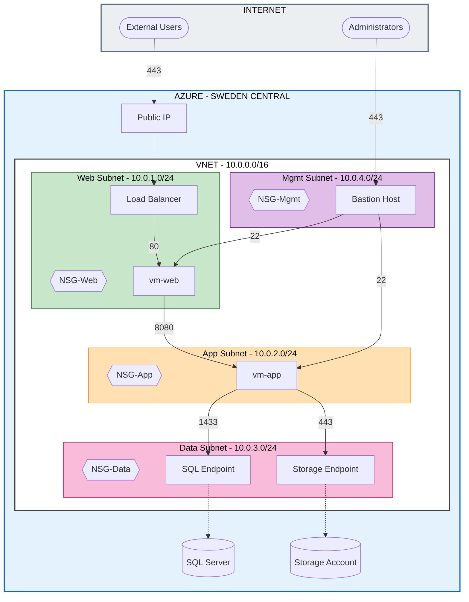
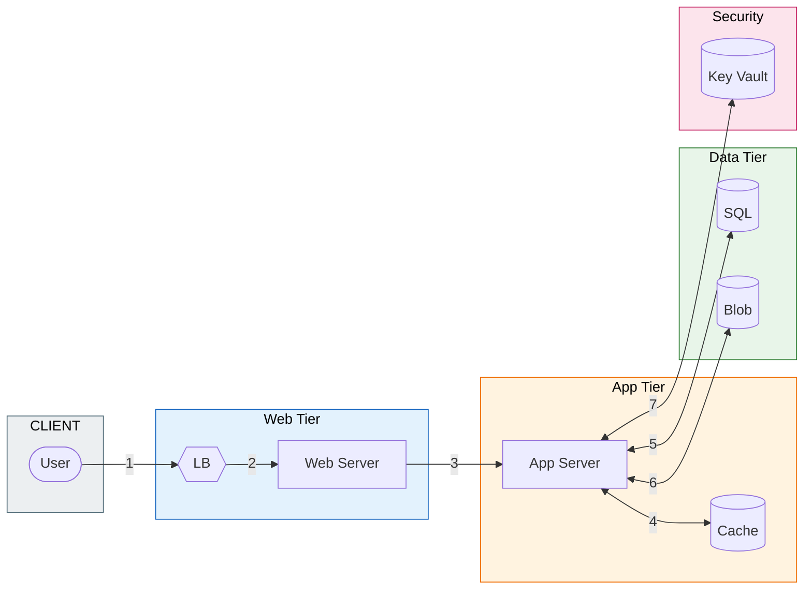
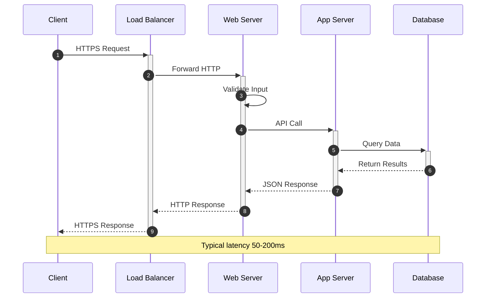
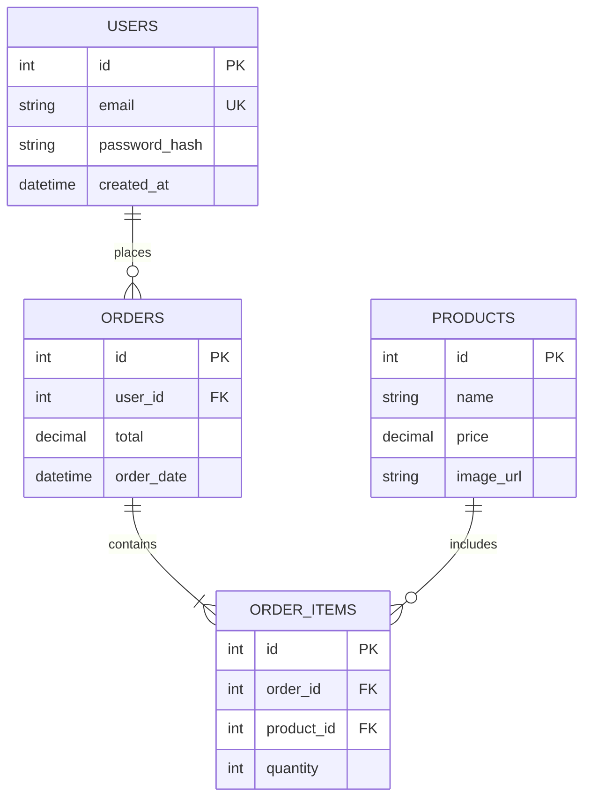
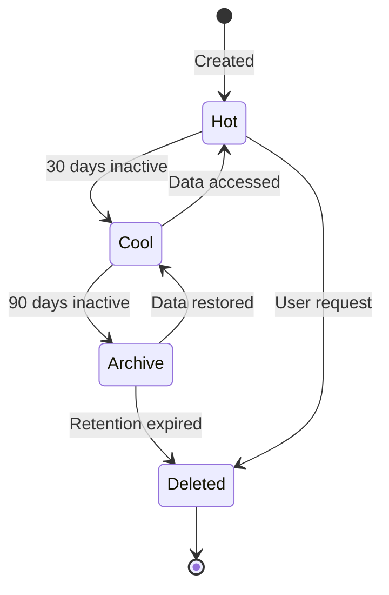
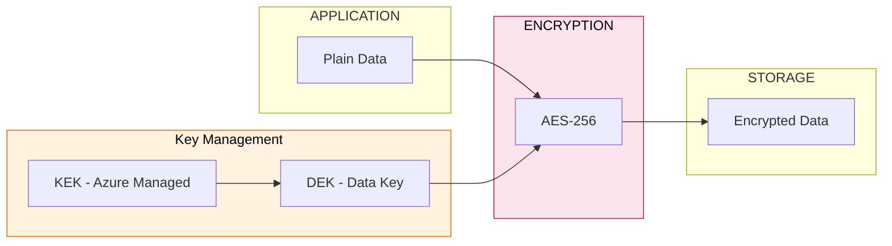
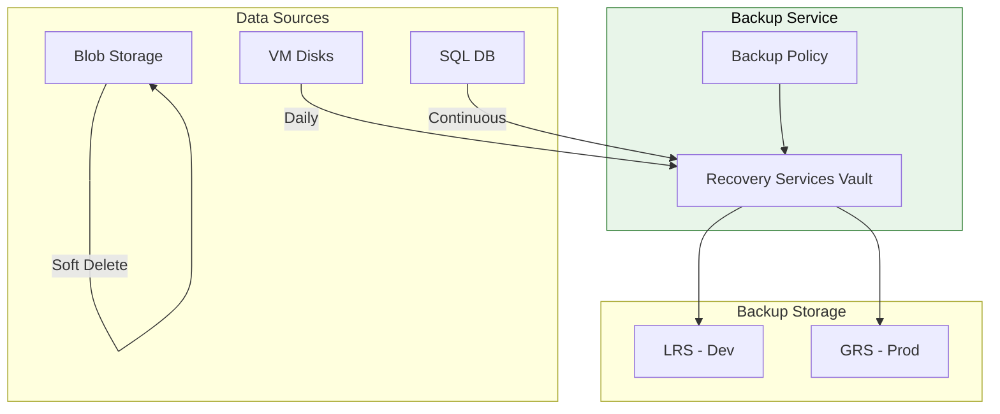

# Azure Cloud Architecture

Enterprise-grade 3-tier cloud infrastructure deployed on Microsoft Azure, designed to meet NOS TECDT90341 standards for cloud architecture solutions.

## Table of Contents

- [Overview](#overview)
- [High-Level Architecture](#high-level-architecture)
- [Network Topology](#network-topology)
- [Data Flow](#data-flow)
- [Storage Architecture](#storage-architecture)
- [Security Architecture](#security-architecture)
- [Deployed Resources](#deployed-resources)
- [Access Information](#access-information)

---

## Overview

### Deployment Summary

| Property | Value |
|----------|-------|
| **Region** | Sweden Central |
| **Resource Group** | rg-cloudarch-dev-swc-001 |
| **Architecture** | 3-Tier (Web, App, Data) |
| **IaC Tool** | Terraform |
| **OS** | Ubuntu 22.04 LTS |

### Architecture Principles

| Principle | Implementation |
|-----------|----------------|
| Scalability | Load Balancer + Availability Sets |
| Security | Defense-in-depth with NSGs, Key Vault |
| Reliability | Multi-zone capable, automated backups |
| Cost Optimization | Right-sized VMs, lifecycle policies |
| Observability | Centralized logging with Log Analytics |

---

## High-Level Architecture

### System Diagram



### Component Summary

| Component | Azure Service | Specification | Purpose |
|-----------|--------------|---------------|---------|
| Load Balancer | Standard SKU | Zone-redundant | Traffic distribution |
| Web VM | Standard_B2s_v2 | 2 vCPU, 8 GB | Nginx reverse proxy |
| App VM | Standard_B2s_v2 | 2 vCPU, 8 GB | Python application |
| SQL Database | Basic DTU | TDE encryption | Relational data |
| Blob Storage | Standard LRS | Lifecycle policies | Unstructured data |
| Key Vault | Standard | RBAC enabled | Secrets management |
| Log Analytics | Per-GB | 30-day retention | Centralized logging |

### Traffic Flow

```
REQUEST FLOW
============

[User] --HTTPS--> [Load Balancer] --HTTP--> [Web VM] --API--> [App VM] --SQL--> [Database]
                                                                  |
                                                                  +--HTTPS--> [Blob Storage]
```

### Security Layers

| Layer | Controls | Implementation |
|-------|----------|----------------|
| Perimeter | DDoS, WAF-ready | Load Balancer |
| Network | Micro-segmentation | NSGs per subnet |
| Identity | Zero-trust | Managed identities |
| Data | Encryption | TDE, AES-256 |
| Monitoring | Detection | Log Analytics |

---

## Network Topology

### Network Diagram



### IP Address Allocation

| Resource | CIDR | IPs | Purpose |
|----------|------|-----|---------|
| VNet | 10.0.0.0/16 | 65,534 | Main network |
| Web Subnet | 10.0.1.0/24 | 251 | Web tier |
| App Subnet | 10.0.2.0/24 | 251 | App tier |
| Data Subnet | 10.0.3.0/24 | 251 | Data tier |
| Mgmt Subnet | 10.0.4.0/24 | 251 | Management |

### Azure Reserved Addresses (per subnet)

| Address | Purpose |
|---------|---------|
| x.x.x.0 | Network |
| x.x.x.1 | Gateway |
| x.x.x.2 | DNS Primary |
| x.x.x.3 | DNS Secondary |
| x.x.x.255 | Broadcast |

### Network Security Groups

#### NSG-Web

| Priority | Name | Direction | Source | Port | Action |
|----------|------|-----------|--------|------|--------|
| 100 | Allow-HTTP | Inbound | Internet | 80 | Allow |
| 110 | Allow-HTTPS | Inbound | Internet | 443 | Allow |
| 120 | Allow-LB | Inbound | AzureLB | * | Allow |
| 150 | Allow-SSH | Inbound | Internet | 22 | Allow |
| 4096 | Deny-All | Inbound | * | * | Deny |

#### NSG-App

| Priority | Name | Direction | Source | Port | Action |
|----------|------|-----------|--------|------|--------|
| 100 | Allow-Web | Inbound | 10.0.1.0/24 | 8080 | Allow |
| 150 | Allow-SSH | Inbound | Internet | 22 | Allow |
| 4096 | Deny-All | Inbound | * | * | Deny |

#### NSG-Data

| Priority | Name | Direction | Source | Port | Action |
|----------|------|-----------|--------|------|--------|
| 100 | Allow-SQL | Inbound | 10.0.2.0/24 | 1433 | Allow |
| 110 | Allow-Storage | Inbound | 10.0.2.0/24 | 443 | Allow |
| 4096 | Deny-All | Inbound | * | * | Deny |

### Connectivity Matrix

| Source | Destination | Protocol | Port | Status |
|--------|-------------|----------|------|--------|
| Internet | Load Balancer | HTTPS | 443 | **Allowed** |
| Load Balancer | Web VMs | HTTP | 80 | **Allowed** |
| Web Subnet | App Subnet | TCP | 8080 | **Allowed** |
| App Subnet | Data Subnet | TCP | 1433 | **Allowed** |
| App Subnet | Storage | HTTPS | 443 | **Allowed** |
| Internet | VMs (NAT) | SSH | 22/2222 | **Allowed** |
| Any | Any | Any | Any | **Denied** |

---

## Data Flow

### Application Data Flow



### Request-Response Sequence



### Data Classification

| Data Type | Classification | Location | Encryption | Retention |
|-----------|---------------|----------|------------|-----------|
| Credentials | Confidential | Key Vault | AES-256 | Indefinite |
| App Data | Internal | SQL Database | TDE | 7 years |
| Sessions | Transient | Memory | N/A | Session |
| Audit Logs | Compliance | Log Analytics | Platform | 2 years |
| Files | Internal | Blob Storage | AES-256 | 1 year |
| Backups | Confidential | GRS Storage | AES-256 | 30 days |

---

## Storage Architecture

### SQL Database Schema



### Blob Storage Structure

```
storage-account/
├── uploads/
│   ├── images/
│   │   └── {year}/{month}/{guid}.jpg
│   └── documents/
│       └── {year}/{month}/{guid}.pdf
├── backups/
│   ├── database/
│   │   └── {date}/backup.bacpac
│   └── config/
│       └── {date}/config.json
└── logs/
    └── archive/
        └── {year}/{month}/logs.gz
```

### Data Lifecycle



| Tier | Access | Cost | Trigger |
|------|--------|------|---------|
| Hot | Frequent | $$$ | Default |
| Cool | Monthly | $$ | 30 days |
| Archive | Yearly | $ | 90 days |
| Delete | N/A | - | Expired |

---

## Security Architecture

### Encryption at Rest



### Encryption in Transit

| Source | Destination | Protocol | Certificate |
|--------|-------------|----------|-------------|
| User | Load Balancer | TLS 1.2+ | Azure Managed |
| LB | Web Server | HTTP | Internal |
| Web | App Server | HTTPS | Self-signed |
| App | SQL Database | TLS 1.2 | Azure Managed |
| App | Blob Storage | HTTPS | Azure Managed |

### Backup Strategy



| Resource | Frequency | Retention | Type |
|----------|-----------|-----------|------|
| VM Disks | Daily | 7 days | Incremental |
| SQL Database | Continuous | 7-35 days | Point-in-time |
| Blob Storage | N/A | 7 days | Soft delete |
| Key Vault | Automatic | 90 days | Soft delete |

---

## Deployed Resources

### Current Resources (19 total)

| Type | Name | Status |
|------|------|--------|
| Resource Group | rg-cloudarch-dev-swc-001 | Active |
| Virtual Network | vnet-cloudarch-dev-swc-001 | Active |
| Subnet (Web) | snet-web-dev-001 | Active |
| Subnet (App) | snet-app-dev-001 | Active |
| Subnet (Data) | snet-data-dev-001 | Active |
| Subnet (Mgmt) | AzureBastionSubnet | Active |
| NSG (Web) | nsg-web-dev-swc-001 | Active |
| NSG (App) | nsg-app-dev-swc-001 | Active |
| NSG (Data) | nsg-data-dev-swc-001 | Active |
| Load Balancer | lb-cloudarch-dev-swc-001 | Active |
| Public IP | pip-lb-cloudarch-dev-swc-001 | Active |
| Availability Set | avset-web-dev-swc-001 | Active |
| VM (Web) | vm-web-dev-swc-001 | Running |
| VM (App) | vm-app-dev-swc-001 | Running |
| SQL Server | sql-cloudarch-dev-swc-001 | Active |
| SQL Database | sqldb-cloudarch-dev-001 | Active |
| Storage Account | stcloudarchdev* | Active |
| Key Vault | kv-cloudarch-dev-* | Active |
| Log Analytics | log-cloudarch-dev-swc-001 | Active |

### Service Endpoints

| Service | Endpoint |
|---------|----------|
| Web Application | `http://<public-ip>` |
| SQL Server | `sql-cloudarch-dev-swc-001.database.windows.net` |
| Key Vault | `https://kv-cloudarch-dev-*.vault.azure.net/` |
| Storage | `https://stcloudarchdev*.blob.core.windows.net/` |

---

## Access Information

### SSH Access via Load Balancer NAT

| VM | Command |
|----|---------|
| Web VM | `ssh azureadmin@<public-ip>` |
| App VM | `ssh -p 2222 azureadmin@<public-ip>` |

### Verified Services

| VM | Service | Version | Status |
|----|---------|---------|--------|
| vm-web-dev-swc-001 | Nginx | 1.18.0 | Running |
| vm-app-dev-swc-001 | Python | 3.10.12 | Installed |
| Load Balancer | HTTP | - | 200 OK |

### Azure CLI Verification

```bash
# List all resources
az resource list --resource-group rg-cloudarch-dev-swc-001 --output table

# Check VM status
az vm list --resource-group rg-cloudarch-dev-swc-001 --show-details --output table

# Test web endpoint
curl -s -o /dev/null -w "%{http_code}" http://<public-ip>
```

---

## Document Information

| Property | Value |
|----------|-------|
| Author | Mohammad Othman |
| Standard | NOS TECDT90341 |
| Last Updated | January 2026 |
| Terraform | >= 1.0 |
| Provider | azurerm 3.x |
